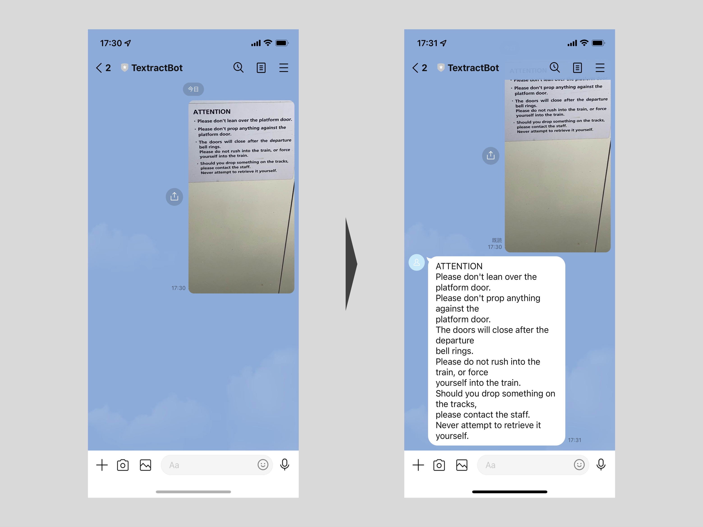

LINE Botを作ろう！AWSで実現するサーバーレスコンピューティング
============================================================

はじめに
------------------------------------------------------------

### a. 記事概要

* [LINEの開発者用SDK](https://github.com/moleike/line-bot-sdk)とAWSを用いてLINE Botを作成します。

### a. 想定読者

* AWS の利用経験があり、サーバーレス実現方式や SAM (Serverless Application Model) について学びたい方。
* 何でも良いからとりあえず LINE Bot を作ってみたい方。

### b. 前提条件

#### AWS

* 利用可能なAWSアカウントを有していること。
* IAMユーザが払い出されており、実施に必要な権限 (ロール, ポリシー 等) が付与されていること。
* ローカル開発環境に AWS CLI がインストールされていること。

#### LINE 

* [LINE Developers](https://developers.line.biz/) の利用登録が完了していること。
* プロバイダの設定が完了していること。※ 作成する Bot (=チャンネル) はプロバイダに紐づきます。

### c. リソース

本記事で使用するリソースは、GitHubに公開しています。

* [roki18d / line_textractbot | GitHub](https://github.com/roki18d/line_textractbot)

### d. 動作確認環境

筆者が動作確認を行った環境は以下の通りです。

```sh
# OS
% sw_vers 
ProductName:    macOS
ProductVersion: 12.0.1
BuildVersion:   21A559

# Python
% python --version
Python 3.7.6
```

### 目次

1. 想定成果物について
2. 実施手順
3. 動作確認
4. 落穂拾い


## 1. 想定成果物について

### 何を作るの？

テキストが写っている画像をアップロードすると、そのテキストをメッセージとして返信してくれる LINE Bot を作っていきます。



### アーキテクチャ概要

大まかなアーキテクチャは以下の通りです。


以下のような処理シーケンスが実行されます。

1. テキストが写っている画像を LINE Bot にアップロードする。
2. LINE プラットフォームがアップロードを検知し、Bot に設定された Webhook URL (API Gateway) をトリガする。
3. API がリクエストを Lambda 関数に中継し、処理させる。
4. Lambda 関数から Boto3 を用いて、LINE Bot シークレット情報を取得する。
5. シークレット情報が Lambda 関数に返却される。
6. 画像メッセージを入力として Textract のテキスト検出 API を実行する。
7. 検出したテキストを Lambda 関数に返却する。
8. テキスト情報等をイベントレスポンスとして API に返却する。
9. イベントレスポンスを LINE プラットフォームに返却する。
10. イベントレスポンスをテキストメッセージとして LINE アプリに返却する。

以降の章で、必要なリソースを作成していきます。

## 2. 実施手順

### 2-1. 事前準備

適当なディレクトリ（以下、`$WORK_DIR`）配下で Git リポジトリをクローンし、移動します。

```zsh
% cd $WORKDIR
% git clone git@github.com:roki18d/glue-job-local-execution.git
% cd glue-job-local-execution
```

必要に応じて、pyenv や conda 等の Python 仮想環境にスイッチします。本記事では予め作成している `aws` という pyenv 仮想環境を使用します。

```zsh
% pyenv local aws
% python --version
Python 3.7.6
```

### 2-2. LINE チャンネルの作成・設定

#### A. チャンネルの作成

[LINE Developers](https://developers.line.biz/) にアクセスし、ログインします。LINE Bot を作成するプロバイダを選択し、チャンネルを作成します。


|Key|Value|
|:--|:--|
|Channel Type|Messaging API|
|Provider| *Provider Name* |
|Channel name|TextractBot|
|Channel description|LINE Bot for Text Extraction from Image|
|Category| *(Any you want)* |
|Subcategory| *(Any you want)* |
|Email address| *Your Email Address* |

最後に利用規約に同意して、"Create" ボタンを押下してチャンネルを作成します。

#### B. シークレット情報の確認

LINE Bot のへの情報アクセスや LINE Bot SDK 利用のために必要なシークレット情報を確認します。

* `LINE_CHANNEL_SECRET` ... [Basic Settings] - [Channel Secret]
* `LINE_CHANNEL_ACCESS_TOKEN` ... [Messaging API] - [Channel access token]

#### C. チャンネルの設定【※任意】

「友だち追加」時のあいさつメッセージや、自動返信設定を無効化しておきます。


### 2-3. 各種 AWS リソースの作成

#### A. Secrets Manager シークレットの作成

チャンネル作成時に確認したシークレット情報を、Secrets Manager 上で管理します。適当な名称でシークレットを作成し、以下の Key-Value ペアを格納します。

|Key|Value|
|:--|:--|
|LINE_CHANNEL_SECRET| *確認したシークレット* |
|LINE_CHANNEL_ACCESS_TOKEN| *確認したアクセストークン* |

> Lambda 関数の環境変数にセットしてしまうという手もありますが、機微な情報を各リソースに散在させたくないという意図から Secrets Manager を利用しています。

#### B. IAM ポリシーの作成

作成したシークレットに格納されているシークレット情報を、Lambda 関数からアクセスできるようにするための IAM ポリシーを作成します。
ポリシー名は任意ですが、本記事では `TextractBot_SecretsManagerFullAccess` として進めます。以下にポリシードキュメントの例を示します。

```json
{
    "Version": "2012-10-17",
    "Statement": [
        {
            "Effect": "Allow",
            "Action": ["secretsmanager:*"],
            "Resource": ["arn:aws:secretsmanager:ap-northeast-1:123412341234:secret:secretsmanager-secret-textractbot-XXXXXX"]
        }
    ]
}
```

#### C. S3 バケットの作成

パッケージ済みアーティファクトのアップロード先となる S3 バケットを作成しておきます。
バケット名は任意ですが、本記事では `yamagishihrd-artifacts` として進めます。


### 2-4. LINE Bot SDK のインストール

Lambda 関数のランタイムに含めるライブラリとして、LINE Bot SDK をインストールします。pip によるインストール時にターゲットディレクトリを指定します。

```
% pip install -t src/main/python/functions/textractbot_function/
```

### 2-5. テンプレートファイルの編集

`template_sample.yaml` の内容を参考に、自身の環境に合わせて `template.yaml` を作成・編集します。
主に修正が必要な項目は、「カスタムポリシーARN」と「シークレットARN」です。

```zsh
% cp template_sample.yaml template.yaml
% vi template.yaml
```

### 2-6. テンプレートのパッケージ & デプロイ

ローカルで開発したリソース群を、AWS 上にデプロイ可能なアーティファクトとしてパッケージします。Lambda 関数ランタイムのコード群は指定した S3 バケットにアップロードされ、パッケージ後のテンプレートファイルはその S3 URI を指定しています。

```zsh
% aws cloudformation package \
    --template-file template.yaml \                   
    --s3-bucket yamagishihrd-artifacts \
    --output-template-file artifacts/packaged-template.yaml
```

パッケージ後のテンプレートファイルを、AWS 上にデプロイします。
バケット名は任意ですが、本記事では `cf-stack-textractbot` として進めます。

```zsh
% aws cloudformation deploy \
    --template-file artifacts/packaged-template.yaml \
    --stack-name cf-stack-textractbot \
    --capabilities CAPABILITY_IAM
```

## 3. 動作確認

### 3-1. Webhook URL のテスト


### 3-2. LINE Bot のテスト


## 4. 落穂拾い

### 4-1. CloudWatch Logs でトラブルシュートする

最初のデプロイでいきなり正常に動作するのは稀だと思います。
Webhook URL を Verify しても "Success" が返ってこない場合は、原因を切り分けてトラブルシュートしていく必要があります。

おそらく大半のエラーが Lambda 関数実行で発生するものではないかと思いますが、その際に強力なのが CloudWtach Logs です。
無事 Lambda 関数がトリガされる所まで通っていれば、該当するロググループにログストリームが生成されているはずです。
Lambda 関数側でかなりのロギング設定を入れていますので、是非確認してみてください。

### 4-2. その他の AI サービスや機械学習モデルを呼び出す

今回は Lambda 関数が呼び出すサービスとして、Textract を取り上げましたが、AWS には他にも様々な AI サービスが用意されています。
また、SageMaker のようなマネージド ML サービスで開発したモデルを推論 API として機能させることも可能です。
これらを Boto3 経由で呼び出すことで、様々なアプリケーションを開発することができます。

[Easily add intelligence to applications | AWS Documentation](https://aws.amazon.com/machine-learning/ai-services/)

## さいごに

LINE Bot 開発については色々な方が情報発信されていますが、画像メッセージを扱ったり、Secrets Manager を利用するアーキテクチャはあまり情報がないかなと思い、今回記事にしてみました。いかがだったでしょうか。

普段はサーバーサイドやデータ分析基盤関連のお仕事をしていますが、時々はフロントエンド界隈の動向にも目を向けていきたいと思います。

最後までご覧頂き、ありがとうございました。

## 参考

* [Messaging API overview | LINE Developers](https://developers.line.biz/en/docs/messaging-api/overview/)
* [AWS SAM+TypeScriptでLINE Bot のサンプルを作成してみました（小ネタ） | DevelopersIO](https://dev.classmethod.jp/articles/line-with-sam-typescript/)
* [Using AWS Lambda with Amazon API Gateway | AWS Documentation](https://docs.aws.amazon.com/lambda/latest/dg/services-apigateway.html)

---
EOF
